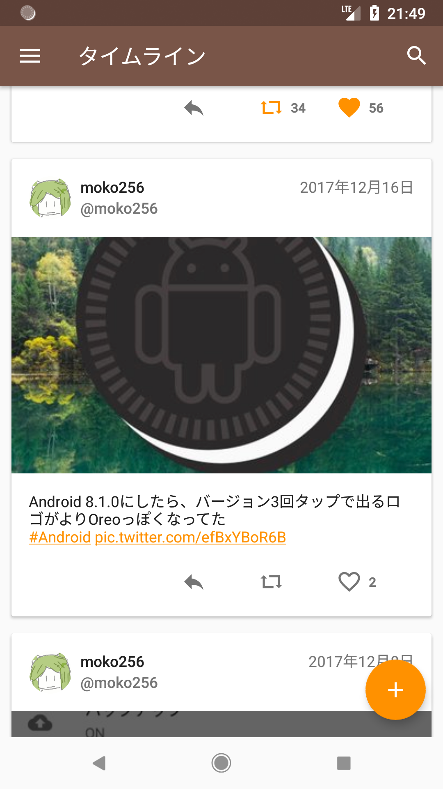
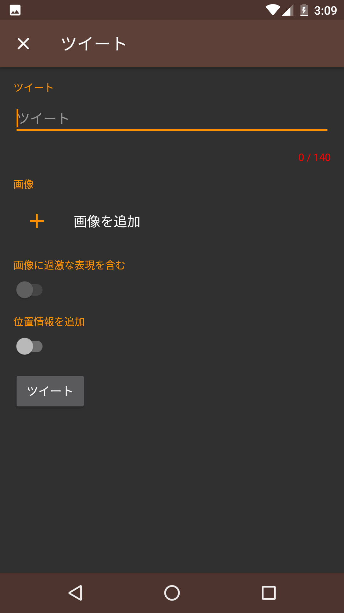
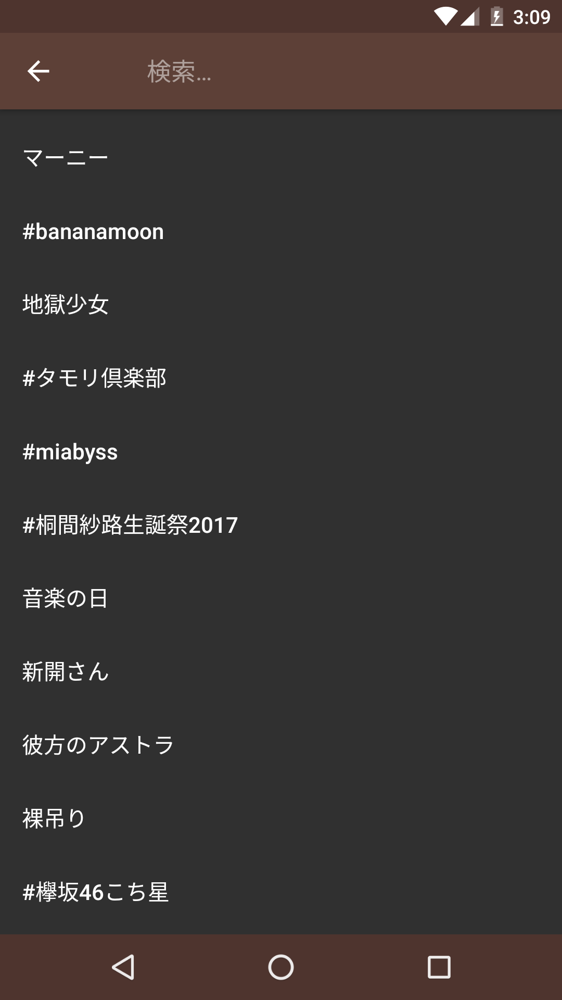

twicalico
====

This application is the Twitter and Mastodon client for Android\.

|Timeline|Post screen|Trends screen|
|---|---|---|
||||

* Minimum api level is 17
* Target api level is 27
* Material Design

## Usage

1. Clone this project\.
2. Open in Android Studio\.
3. Add gradle.properties file and add CONSUMER_KEY and CONSUMER_SECRET properties for Twitter\.
4. Build\.

## Dependencies

This application is built using these libraries\:

* Android Compatibility Library v4
* Android Compatibility Library v7
* Android Compatibility Library v14
* Android Design Support Library
* Android Custom Tabs Support Library
* Glide
* google-gson
* PhotoView
* OkHttp
* mastodon4j
* Twitter4J
* twitter-text
* RxJava
* RxAndroid

and, built using these tools\:

* Android SDK
* Android Studio
* Open JDK
* Kotlin
* Gradle
* Proguard

## License

~~~~
Copyright 2017 The twicalico authors

Licensed under the Apache License, Version 2.0 (the "License");
you may not use this file except in compliance with the License.
You may obtain a copy of the License at

    http://www.apache.org/licenses/LICENSE-2.0

Unless required by applicable law or agreed to in writing, software
distributed under the License is distributed on an "AS IS" BASIS,
WITHOUT WARRANTIES OR CONDITIONS OF ANY KIND, either express or implied.
See the License for the specific language governing permissions and
limitations under the License.
~~~~
